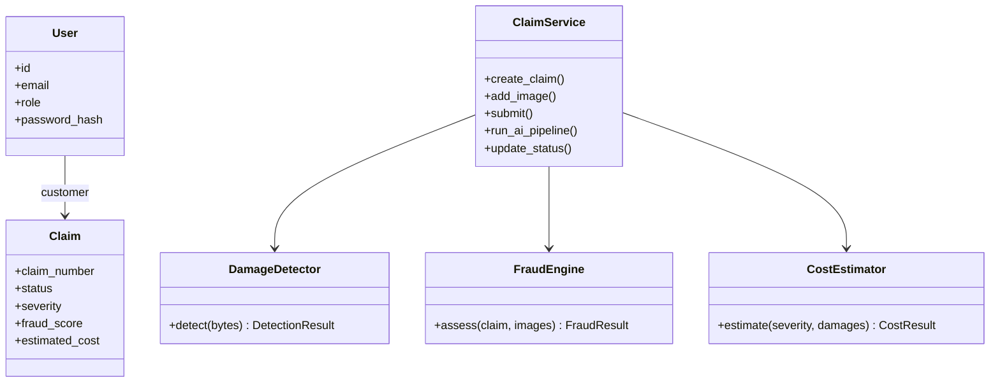

# Class Diagram (core domain)

```mermaid
classDiagram
  class User {
    +id
    +email
    +role
    +password_hash
  }
  class Claim {
    +claim_number
    +status
    +severity
    +fraud_score
    +estimated_cost
  }
  class DamageDetector {
    +detect(bytes) DetectionResult
  }
  class FraudEngine {
    +assess(claim, images) FraudResult
  }
  class CostEstimator {
    +estimate(severity, damages) CostResult
  }
  class ClaimService {
    +create_claim()
    +add_image()
    +submit()
    +run_ai_pipeline()
    +update_status()
  }
  ClaimService --> DamageDetector
  ClaimService --> FraudEngine
  ClaimService --> CostEstimator
  User --> Claim : customer
```
