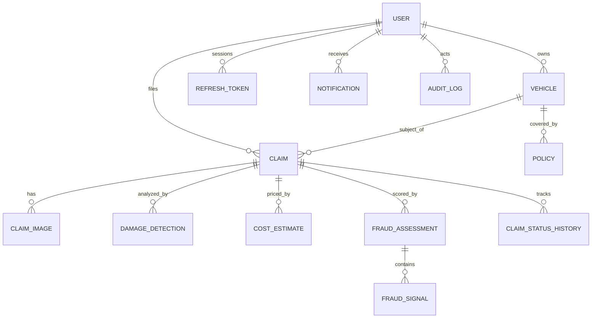

# ER Diagram

```mermaid
erDiagram
  USER ||--o{ VEHICLE : owns
  USER ||--o{ CLAIM : files
  VEHICLE ||--o{ POLICY : covered_by
  VEHICLE ||--o{ CLAIM : subject_of
  CLAIM ||--o{ CLAIM_IMAGE : has
  CLAIM ||--o{ DAMAGE_DETECTION : analyzed_by
  CLAIM ||--o{ COST_ESTIMATE : priced_by
  CLAIM ||--o{ FRAUD_ASSESSMENT : scored_by
  FRAUD_ASSESSMENT ||--o{ FRAUD_SIGNAL : contains
  CLAIM ||--o{ CLAIM_STATUS_HISTORY : tracks
  USER ||--o{ REFRESH_TOKEN : sessions
  USER ||--o{ NOTIFICATION : receives
  USER ||--o{ AUDIT_LOG : acts
```
