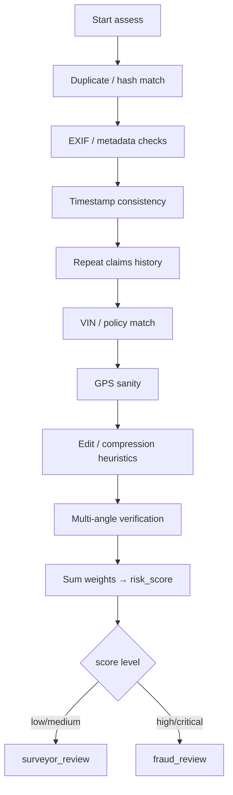

# Flow Chart — Fraud engine

```mermaid
flowchart TD
  A[Start assess] --> B[Duplicate / hash match]
  B --> C[EXIF / metadata checks]
  C --> D[Timestamp consistency]
  D --> E[Repeat claims history]
  E --> F[VIN / policy match]
  F --> G[GPS sanity]
  G --> H[Edit / compression heuristics]
  H --> I[Multi-angle verification]
  I --> J[Sum weights → risk_score]
  J --> K{score level}
  K -->|low/medium| L[surveyor_review]
  K -->|high/critical| M[fraud_review]
```
