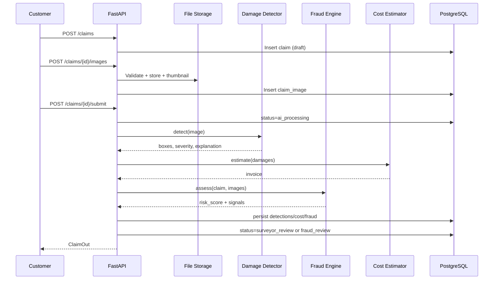

# Sequence — Claim submission

```mermaid
sequenceDiagram
  participant C as Customer
  participant API as FastAPI
  participant FS as File Storage
  participant AI as Damage Detector
  participant FR as Fraud Engine
  participant CE as Cost Estimator
  participant DB as PostgreSQL

  C->>API: POST /claims
  API->>DB: Insert claim (draft)
  C->>API: POST /claims/{id}/images
  API->>FS: Validate + store + thumbnail
  API->>DB: Insert claim_image
  C->>API: POST /claims/{id}/submit
  API->>DB: status=ai_processing
  API->>AI: detect(image)
  AI-->>API: boxes, severity, explanation
  API->>CE: estimate(damages)
  CE-->>API: invoice
  API->>FR: assess(claim, images)
  FR-->>API: risk_score + signals
  API->>DB: persist detections/cost/fraud
  API->>DB: status=surveyor_review or fraud_review
  API-->>C: ClaimOut
```
